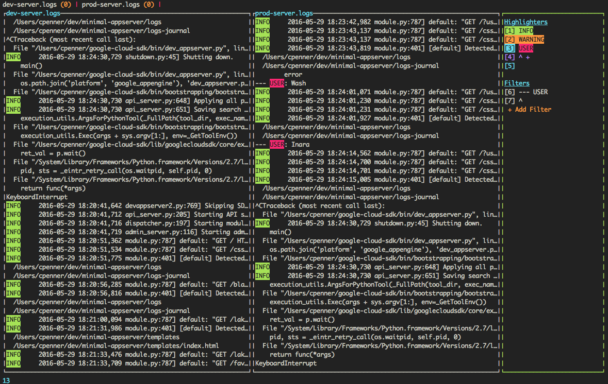

# LumberJack 

## What is it?
A command-line interface log viewer

## Why did I build it
I got really sick of trying to find the things I was looking for in a big blob of unstructured text.
Printing my logs out to the terminal just wasn't sufficient anymore.

## What's it do?
Well, first and foremost it show your logs...

It can also:
- Stream logs into the viewer as they occur
- Filter to only show lines matching a given search term or regular expression
- Perform a search (from the latest logs upwards of course)
- Display logs from multiple servers side by side
- Display multiple views into the same log file
- Highlight text matching a given regular expression
